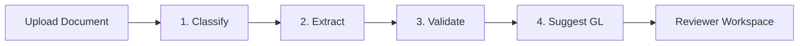

# 📄 E2E Intelligent Invoice & Receipt Review Pipeline

> **Live Demo**: 🚀 [https://app-invoice-review.redcoast-d7dfd6c7.centralindia.azurecontainerapps.io/](https://app-invoice-review.redcoast-d7dfd6c7.centralindia.azurecontainerapps.io/)

An end-to-end, enterprise-grade application for automated processing, validation, and human-in-the-loop review of supplier invoices and employee expense receipts. Built for **Northstar Facilities B.V.** (a fictional Amsterdam-based facilities management firm), this application seamlessly integrates Azure AI document extraction, deterministic VAT & financial policy validation rules, SQLite persistence, and an intuitive React review workspace.

---

## 🌟 Key Highlights & Live Demo

- **Live Deployment**: Hosted on **Azure Container Apps** with persistent **Azure Files** storage.
- **Single-Container Architecture**: Fast, zero-CORS deployment uniting FastAPI and Vite React static bundle.
- **Password Protected**: Simple workspace access lock screen.
- **Security Hardened**: Binary Magic Bytes validation, IP Rate Limiting (5 uploads/5 mins), Path Traversal defense, and HTTP Security Headers.

---

## ⚙️ 4-Step Intelligent Pipeline



1. **Classify**: Identifies whether the uploaded file is a Commercial Invoice, Employee Receipt, or Unknown document.
2. **Extract**: Merges dual-track readings from **Azure AI Document Intelligence** and **Azure OpenAI Vision** with field-level provenance.
3. **Validate**: 
   - EU VAT ID formatting & checksum validation.
   - Mathematical line-item vs. subtotal vs. tax total verification.
   - Multi-field duplicate invoice detection across existing records.
4. **Suggest GL**: Matches vendor and item line types against Northstar's General Ledger Account catalog with confidence scores and reasoning.

---

## 🛠️ Maya's Reviewer Loop & Features

- 📝 **Field Correction Modal**: Reviewers can edit extracted normalized fields (`vendor_name`, `total_amount`, `vat_number`, etc.) at any time.
- 🏷️ **GL Account Override**: Interactive catalog dropdown allowing reviewers to confirm or override GL account codes with custom notes.
- ⚡ **Approve / Reject Action Bar**: High-contrast decision controls for financial sign-off.
- ✉️ **Supplier Correction Email Generator**: One-click draft email generation outlining specific validation errors to send back to suppliers, complete with copy-to-clipboard functionality.
- 📜 **Review History & Data Management**: Searchable historical list of all processed documents with explicit deletion safety dialogs.

---

## 🔒 Security Hardening

- **Magic Byte File Inspection**: Inspects actual binary header bytes (`%PDF-`, `\xFF\xD8\xFF`, `\x89PNG\r\n\x1a\n`) to block MIME header spoofing.
- **Path Traversal Protection**: Enforces `Path(filename).name` and restricts file writes strictly within resolved `upload_dir`.
- **IP Rate Limiting**: In-memory sliding window rate limiter capping uploads at **5 requests / 5 minutes per IP**.
- **Security Response Headers**: Injects `X-Content-Type-Options: nosniff`, `X-Frame-Options: SAMEORIGIN`, `X-XSS-Protection`, and `Referrer-Policy`.
- **SQL Injection Defense**: 100% SQLAlchemy ORM parameterized queries (`select()`, `.where()`, `.get()`).

---

## 🏗️ Architecture & Azure Single-Container Setup

```
                         ┌──────────────────────────────┐
                         │ Azure Files mount /app/data  │
                         │ (SQLite & uploads storage)   │
                         └──────────────▲───────────────┘
                                        │
┌────────────────┐     ┌────────────────┴───────────────┐     ┌────────────────────────────────┐
│                │     │                                │ ───>│ di-invoice-review-harsh        │
│                │ ───>│ /api and /health               │     │ (Azure Document Intelligence)  │
│ uvicorn :8000  │     │                                │     └────────────────────────────────┘
│                │     └────────────────────────────────┘     ┌────────────────────────────────┐
│                │                                            │ rg-invoice-review-harsh-foundry│
│                │     ┌────────────────────────────────┐ ───>│ (Azure AI Foundry / OpenAI)    │
│                │ ───>│ Static SPA from frontend/dist  │     └────────────────────────────────┘
└────────────────┘     └────────────────────────────────┘
```

- **Container Engine**: Multi-stage `Dockerfile` combining Node.js 20 build stage with Python 3.10 slim runtime.
- **Persistent Storage**: Azure File Share (`share-invoice-review`) mounted at `/app/backend/data` ensures zero data loss during scale-to-zero events.
- **Cost Optimized**: Container App runs on **Consumption Tier** (`0.25 vCPU`, `0.5 GiB RAM`) with `--min-replicas 0` (~€0 cost when idle).

---

## 💻 Tech Stack

- **Backend**: Python 3.10+, FastAPI, Pydantic v2, SQLAlchemy 2, SQLite, `uv`
- **Frontend**: React 19, TypeScript, Vite, Tailwind CSS, Lucide Icons, `pnpm`
- **AI Integrations**: Azure AI Document Intelligence & Azure OpenAI
- **DevOps / Cloud**: Docker, Azure Container Registry (ACR), Azure Container Apps (ACA), Azure Files

---

## 🚀 Local Development Setup

### Prerequisites
- Python 3.10 or newer
- [uv](https://github.com/astral-sh/uv) package manager
- Node.js 20 or newer
- `pnpm` package manager

### 1. Install Dependencies
```bash
# Backend
cd backend
uv sync

# Frontend
cd ../frontend
pnpm install
```

### 2. Environment Configuration
Copy environment template files:
- `backend/.env.example` → `backend/.env` (Add your Azure OpenAI & Azure Document Intelligence credentials)
- `frontend/.env.example` → `frontend/.env` (`VITE_API_BASE_URL=http://localhost:8000`)

### 3. Run Development Servers
```bash
# Terminal 1: Backend
cd backend
uv run uvicorn app.main:app --reload

# Terminal 2: Frontend
cd frontend
pnpm dev
```
Open `http://localhost:5173/` in your browser.

---

## 🧪 Code Quality & Verification

```bash
# Backend Linting & Security Check
cd backend
uv run ruff check app

# Frontend Type-check & Build Verification
cd ../frontend
pnpm exec tsc -b
pnpm build
```

---

## 🧹 Post-Demo Azure Teardown

To clean up all Azure deployment resources after testing:

```bash
az containerapp delete --name app-invoice-review --resource-group rg-invoice-review --yes
az storage account delete --name stinvrevharsh --resource-group rg-invoice-review --yes
az acr delete --name acrinvoicereviewharsh --resource-group rg-invoice-review --yes
```

---

## 📄 License

Distributed under the MIT License. See `LICENSE` for details.
